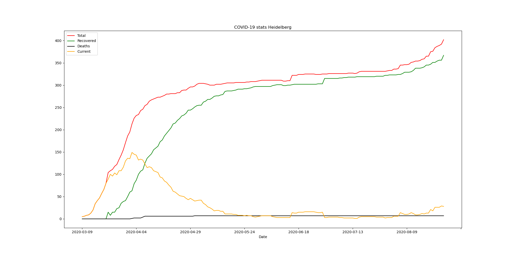
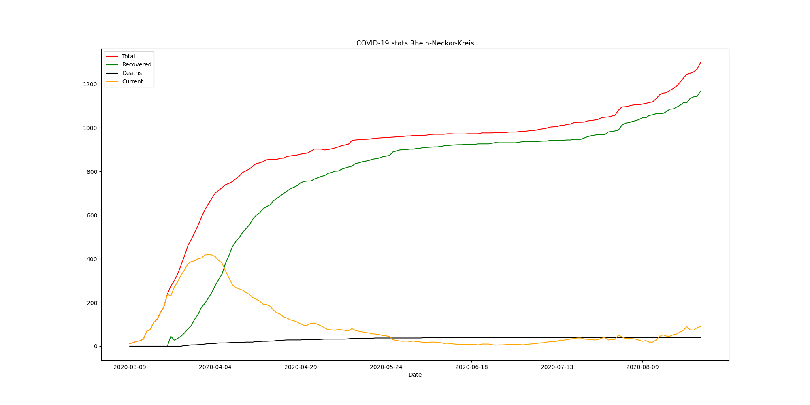

# COVID-19 plots Heidelberg and Rhein-Neckar-Kreis

Data source: https://www.rhein-neckar-kreis.de/start/landratsamt/coronavirus+fallzahlen.html

A code to automatically download/parse PDF summaries provided by Landratsamt RNK and plot them. For details please refer to the `CoronaStats.ipynb`.

